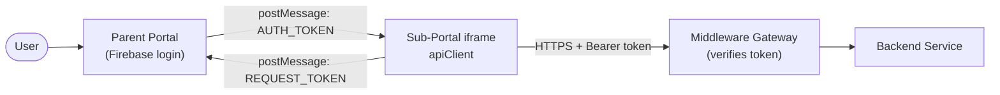
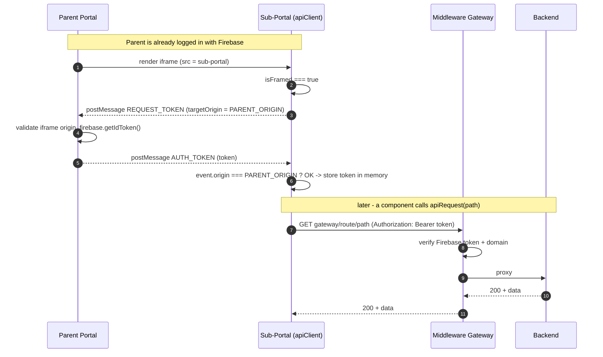
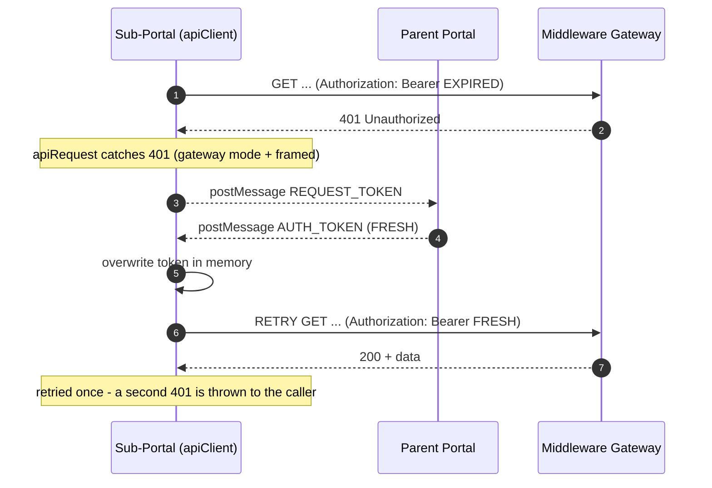

# Sub-Portal Auth Integration — One Guide for All Portals

**Audience:** any portal team embedding a sub-portal inside the **Internal Portal**.
**Goal:** authenticate a sub-portal's backend calls using the parent portal's Firebase
login — with **no login of its own** — plus a one-flag **local dev mode** so a developer
can work on just the frontend + backend without cloning the whole stack.

This file is self-contained: a new portal can be built from it alone. This repo's
reference implementation is [`src/api/apiClient.js`](../src/api/apiClient.js) (REST +
token handshake) and [`src/services/chatService.js`](../src/services/chatService.js)
(WebSocket).

---

## 1. Mental model

> The **parent** portal is logged in with Firebase. An embedded sub-portal (in an
> `<iframe>`) has **no login of its own**. It **asks the parent** for a short-lived
> Firebase **ID token** over `postMessage`, keeps it **in memory**, and stamps it as
> `Authorization: Bearer <token>` on **every** backend call. Calls go to a **middleware
> gateway** that verifies the token before proxying to the real backend. On expiry
> (HTTP `401`) the app asks the parent for a **fresh** token and retries **once**.

Three properties make this safe:

1. The **long-lived refresh token never leaves the parent** — the sub-portal only sees
   short-lived (~1h) ID tokens.
2. **Both sides check origins** — the parent validates the iframe origin; the sub-portal
   ignores any message whose origin isn't the exact parent origin.
3. The **gateway/backend is the real gate** — no valid token → `401`. The frontend is
   never a security boundary.

---

## 2. Two run modes

One env var, `APP_ENV`, selects the mode. Only the exact word `local` opts into local
mode (and only on a real `localhost` host); anything else is the secure gateway path.
**Fail safe, never open.**

| `APP_ENV` | Request goes to | Auth header | Parent handshake | Use |
|---|---|---|---|---|
| `local` (on localhost) | `LOCAL_API_URL` directly | `X-Api-Key` | **off** | Local development |
| anything else | `MIDDLEWARE_BASE_URL/GATEWAY_ROUTE` | `Authorization: Bearer <firebase>` | on | Deployed (test/prod) |

**Why local mode exists:** gateway mode needs the parent portal *and* the gateway
running. `APP_ENV=local` removes both, so a developer only runs the **frontend +
backend**. It is for building screens quickly — anything touching real auth, CORS, or
token expiry still needs a pass inside the real parent portal before it ships.

---

## 3. Architecture



The token only ever travels two ways: **`postMessage`** (parent → child, in-browser)
and the **`Authorization` header** (child → gateway). Never a URL, never a cookie, never
storage that survives the tab. (WebSockets are the one exception — see §7.)

---

## 4. The message contract (do not change the shapes)

| Direction | Message | Sent when |
|---|---|---|
| Child → Parent | `{ type: "REQUEST_TOKEN" }` | On load (warm-up), and after any `401`. |
| Parent → Child | `{ type: "AUTH_TOKEN", token: "<jwt>" }` | In reply, **and** proactively when the parent refreshes. |

**Rules that MUST hold:**

1. Post to `window.parent` with `targetOrigin` = the exact `PARENT_ORIGIN`, never `"*"`.
2. Process an incoming message **only if** `event.origin === PARENT_ORIGIN`.
3. Keep the `message` listener **always active** so the parent can push a refreshed
   token at any time; just overwrite what you hold.
4. Send the token **only** as `Authorization: Bearer` — never a query/URL (except WS, §7).

---

## 5. Sequence — first load & first request (gateway happy path)



## 6. Sequence — token expired → 401 → refresh → retry



- The refresh is **reactive** — no expiry timers; a `401` is the trigger.
- The parent may also push a fresh `AUTH_TOKEN` **unprompted** (~hourly); the always-on
  listener just overwrites the stored token.
- Retry happens **once**. A second `401` propagates.

> **No token ≠ 401.** If the parent never answers (e.g. `PARENT_ORIGIN` mismatch), the
> request should not hang forever — put a short timeout on the token request, then send
> unauthenticated so the gateway returns a real `401`, or surface an error.

---

## 7. Attaching the token to requests

### 7a. REST (the normal case)

One function every REST call goes through, so auth + the 401-retry live in one place:

```js
const CH_BASE_URL = IS_LOCAL
  ? LOCAL_API_URL
  : `${MIDDLEWARE_BASE_URL}/${GATEWAY_ROUTE}`;

async function authHeader(token) {
  if (IS_LOCAL) return LOCAL_API_KEY ? { "X-Api-Key": LOCAL_API_KEY } : {};
  if (token) return { Authorization: `Bearer ${token}` };
  if (!canTalkToParent) return {};
  const fresh = await getToken();
  return fresh ? { Authorization: `Bearer ${fresh}` } : {};
}

export async function apiRequest(path, opts = {}) {
  const send = (auth) => axios({ url: `${CH_BASE_URL}${path}`, ...opts,
    headers: { "Content-Type": "application/json", ...opts.headers, ...auth } });

  try {
    return (await send(await authHeader())).data;
  } catch (err) {
    // gateway mode only: expired token -> fresh one -> retry once
    if (IS_LOCAL || err.response?.status !== 401 || !canTalkToParent) throw err;
    return (await send(await authHeader(await requestToken()))).data;
  }
}
```

Call sites stay auth-unaware: `apiRequest("/api/v1/fund-ratings")`.

### 7b. WebSockets (the one exception)

A browser `WebSocket` **cannot** set an `Authorization` header, so the token rides in
the query string. Same `getToken()` source, different transport:

```js
const token = IS_LOCAL ? LOCAL_API_KEY : (await getToken().catch(() => ""));
const base  = IS_LOCAL ? `${LOCAL_WS_URL}/api/v1/...`
                       : `${GATEWAY_WS_URL}/ws/${GATEWAY_ROUTE}/api/v1/...`;
new WebSocket(`${base}?session_id=${id}&token=${encodeURIComponent(token)}`);
```

Validate the token **at connect time** on the gateway; keep it out of access logs.

---

## 8. Token lifecycle & storage

Three module-level pieces of state plus a few functions, all in memory for the tab's
lifetime:

| State | Role |
|---|---|
| `authToken` | Current Firebase ID token, or `null` before the first arrives. |
| `tokenWaiters` | Resolvers waiting on an in-flight `REQUEST_TOKEN`, so callers don't race. |
| `isFramed` / `canTalkToParent` | Gate the handshake: embedded, not local, parent known. |

```js
// The only writer of authToken — stays active for the tab's lifetime.
window.addEventListener("message", (event) => {
  if (event.origin !== PARENT_ORIGIN) return;      // trust only the parent
  if (event.data?.type !== "AUTH_TOKEN") return;
  authToken = event.data.token;
  tokenWaiters.forEach((r) => r(authToken));
  tokenWaiters = [];
});

function requestToken() {                            // post + wait for AUTH_TOKEN
  if (!canTalkToParent) return Promise.resolve(null);
  window.parent.postMessage({ type: "REQUEST_TOKEN" }, PARENT_ORIGIN);
  return new Promise((resolve) => tokenWaiters.push(resolve));
}
const getToken = () => authToken ? Promise.resolve(authToken) : requestToken();
if (canTalkToParent) requestToken();                 // warm-up on load
```

**Why in-memory, not cookie/localStorage?** A cookie is auto-sent (CSRF-exposed, shared
across tabs); localStorage persists a bearer token to disk. An in-memory variable is
scoped to the tab, cleared on close, and only ever set from an origin-verified message —
the smallest attack surface.

---

## 9. Environment variables

Copy [`.env.example`](../.env.example) → `.env` (gitignored) and fill in. Names are shown
without a build prefix; expose them however your bundler does — **Vite** as
`import.meta.env.VITE_*`, or wired to `process.env.*` via `define` (as this repo does).

| Variable | Mode | Meaning |
|---|---|---|
| `APP_ENV` | switch | `local` for standalone dev; empty/other = gateway. |
| `PARENT_ORIGIN` | gateway | Exact parent origin — scheme+host+port, **no trailing slash**. |
| `MIDDLEWARE_BASE_URL` | gateway | Gateway host for REST. |
| `GATEWAY_ROUTE` | gateway | **This portal's** route on the gateway (e.g. `chat-history`, `mf-info`). |
| `GATEWAY_WS_URL` | gateway | Gateway host for WebSockets (`wss://` in prod). |
| `LOCAL_API_URL` | local | Backend REST base, called directly. |
| `LOCAL_WS_URL` | local | Backend WebSocket base, called directly. |
| `LOCAL_API_KEY` | local | Sent as `X-Api-Key`. |

> A **`PARENT_ORIGIN` mismatch is the #1 bug**: `postMessage` with a `targetOrigin` that
> doesn't equal the real parent origin is silently dropped, so the token never arrives.
> Running the parent locally? Set `PARENT_ORIGIN=http://localhost:3000` (not the prod
> origin) and rebuild.

---

## 10. Security (must all hold)

**Handshake / token**
- `postMessage` `targetOrigin` is the exact `PARENT_ORIGIN`, never `"*"`; incoming
  messages ignored unless `event.origin === PARENT_ORIGIN`.
- Token attached **only** as `Authorization: Bearer` (WS query is the sole exception),
  held **in memory only**, and **never logged**.
- The refresh token never reaches the sub-portal. The gateway verifies the token
  (Firebase Admin SDK) + domain and returns `401` when absent/invalid.
- The host allows framing by the parent (`Content-Security-Policy: frame-ancestors`),
  and the gateway CORS-allows the sub-portal origin + the `Authorization` header.

**Local dev mode**
- Env values are **inlined at build time**. `npm run dev` reads `.env` live, but a built
  bundle freezes them — editing `.env` under `preview`/a deployed bundle does nothing.
- **Local vars never reach a deployed build:** the Dockerfile passes only gateway args;
  `.dockerignore` excludes `.env`/`.env.*`.
- **The Dockerfile refuses a local image:** `ARG APP_ENV=production` + a guard that fails
  the build when `APP_ENV=local`; CI passes `APP_ENV=${{ vars.APP_ENV || 'production' }}`.
- **Runtime is fail-safe:** local mode requires a real `localhost` host, so a stray local
  build on a real host silently uses the secure path — no auth bypass.
- **Nothing is revealed:** a misconfigured app shows a generic **"Server configuration
  error"** screen ([ConfigError.jsx](../src/components/ConfigError.jsx)) that never names
  the mode or the missing variable. Developers learn local dev from the code +
  `.env.example`, never from the running app.

> Because env values are inlined, a build made *with* `APP_ENV=local` and a real
> `LOCAL_API_KEY` **will** contain that key in the public bundle — which is exactly why
> local builds must never be deployed, and why the guards above exist.

---

## 11. What the parent provides (already built — for reference)

Implemented once, reused by all sub-portals. It: (1) listens for `REQUEST_TOKEN`;
(2) validates the iframe origin against an allow-list; (3) replies `AUTH_TOKEN` with a
fresh `firebase.getIdToken()`, `targetOrigin` = that iframe's origin; (4) re-pushes
`AUTH_TOKEN` on its own refresh. **You rely on it — you don't implement it.**

---

## 12. New-portal checklist

- [ ] Add one `apiClient` module: the §8 state + handshake and the §7 `apiRequest`,
      branching **base URL** and **auth header** on a single `IS_LOCAL`.
- [ ] Route **every** backend call through it (REST) / `getToken()` (WS). No raw
      `fetch`/`axios` to the backend anywhere else.
- [ ] Set the §9 env vars per environment; register your portal's `GATEWAY_ROUTE` with
      the gateway team.
- [ ] Gate local mode to `APP_ENV=local` **and** a localhost host; keep the handshake
      inert and skip the 401-retry in local mode.
- [ ] Add the Dockerfile guard, `.dockerignore` (`.env`, `.env.*`), and a generic
      "Server configuration error" fallback. Never log the token.
- [ ] Confirm the gateway verifies your tokens + allows your origin (CORS), and your host
      allows framing by the parent.
- [ ] Test: embedded in the parent → first call carries `Bearer` → force expiry →
      confirm one `REQUEST_TOKEN` + retry; `APP_ENV=local` → calls the backend directly
      with `X-Api-Key`, no handshake; a production build carries **no** local key.

---

*Reference: this repo reads env as `process.env.*` (Vite `define`) with route var
`CH_GATEWAY_ROUTE`; `paisasmart-rm-portal` reads `import.meta.env.VITE_*` with
`VITE_MF_GATEWAY_ROUTE`. Same pattern, different names.*
