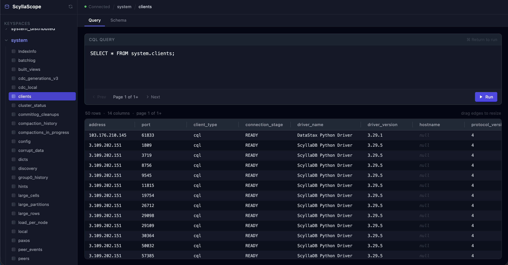
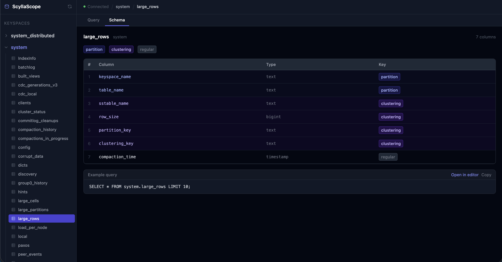

# ScyllaScope

> v1.0 — Stable release

A browser-based visualiser for ScyllaDB / Cassandra clusters. Browse keyspaces and tables, inspect schemas, and run CQL queries — all from a clean UI. Ships as a single Docker container with a FastAPI backend and a React + Vite frontend served by nginx.


---

## Features

- Connect to any ScyllaDB / Cassandra cluster (with or without authentication)
- Browse keyspaces and tables via the schema viewer
- Run CQL queries with a built-in query runner and results table
- SSL/TLS support with CA certificate
- Single-container deployment — no orchestration required

---

## Screenshots

**Query Runner** — write and execute CQL queries with paginated results



**Schema Viewer** — inspect table columns, types, and key roles at a glance



---

## Requirements

- Docker 20.10+
- A running ScyllaDB or Cassandra cluster reachable from the host

---

## Quick start

### 1. Clone the repo

```bash
git clone https://github.com/paisasmart/ScyllaScope.git
cd ScyllaScope
```

### 2. Configure

```bash
cp .env.example .env
```

Edit `.env` with your cluster details:

```env
SCYLLA_CONTACT_POINTS=192.168.1.10,192.168.1.11
SCYLLA_PORT=9042
SCYLLA_USERNAME=your_user
SCYLLA_PASSWORD=your_pass
```

### 3. SSL / TLS (optional)

If your cluster requires SSL, place your CA certificate in the project root as `cert.pem`, then set in `.env`:

```env
SCYLLA_SSL=true
SCYLLA_CA_CERT_FILE=/certs/ca.pem
```

`cert.pem` is copied into the image at `/certs/ca.pem` during the build — `SCYLLA_CA_CERT_FILE` is always this fixed path, do not change it. `cert.pem` is excluded from git.

### 4. Build

```bash
docker build -t scyllascope .
```

### 5. Run

```bash
docker run -d \
  --name scyllascope \
  --env-file .env \
  -p 80:80 \
  scyllascope
```

Open [http://localhost](http://localhost) in your browser.
API docs are at [http://localhost:8000/docs](http://localhost:8000/docs).

---

## Environment variables

| Variable | Default | Description |
|---|---|---|
| `SCYLLA_CONTACT_POINTS` | `127.0.0.1` | Comma-separated ScyllaDB hostnames or IPs |
| `SCYLLA_PORT` | `9042` | ScyllaDB native transport port |
| `SCYLLA_USERNAME` | _(empty)_ | Authentication username |
| `SCYLLA_PASSWORD` | _(empty)_ | Authentication password |
| `SCYLLA_SSL` | `false` | Enable SSL/TLS |
| `SCYLLA_CA_CERT_FILE` | _(empty)_ | Fixed as `/certs/ca.pem` when SSL is enabled — do not change |
| `APP_ENV` | `production` | Application environment |
| `APP_PORT` | `8000` | Backend port (internal) |
| `LOG_LEVEL` | `INFO` | Log level: `DEBUG` / `INFO` / `WARNING` / `ERROR` |
| `BACKEND_URL` | `http://localhost:8000` | nginx proxy target — keep as-is for single-container use |

---

## Project structure

```
ScyllaScope/
├── scylla-service/          # FastAPI backend (Python 3.10)
│   ├── app/
│   │   ├── api/v1/          # Routers: health, keyspaces, tables, query
│   │   ├── core/            # Config, logging
│   │   ├── db/              # ScyllaDB session
│   │   └── services/        # Business logic
│   └── requirements.txt
├── scylla-fe/               # React + Vite frontend
│   ├── src/
│   │   ├── components/      # QueryRunner, ResultsTable, SchemaViewer, Sidebar
│   │   └── pages/           # MainPage
│   └── nginx.conf.template
├── Dockerfile
├── docker-entrypoint.sh
├── cert.pem                 # CA certificate — not committed to git
├── .env.example
└── .dockerignore
```

---

## Local development

### Backend

```bash
cd scylla-service
python -m venv .venv && source .venv/bin/activate
pip install -r requirements.txt
cp .env.example .env   # edit as needed
uvicorn app.main:app --reload --port 8000
```

### Frontend

```bash
cd scylla-fe
npm install
BACKEND_URL=http://localhost:8000 
npm run dev
```

---

## API endpoints

| Method | Path | Description |
|---|---|---|
| `GET` | `/api/v1/health` | Health check |
| `GET` | `/api/v1/keyspaces` | List all keyspaces |
| `GET` | `/api/v1/keyspaces/{keyspace}/tables` | List tables in a keyspace |
| `POST` | `/api/v1/query` | Execute a CQL query |

Full interactive docs available at `/docs` when the container is running.

